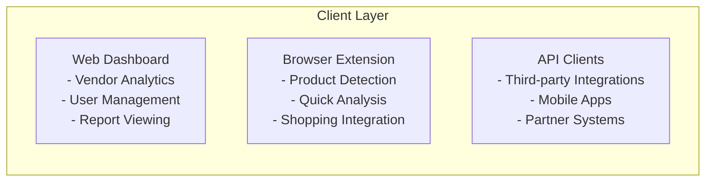
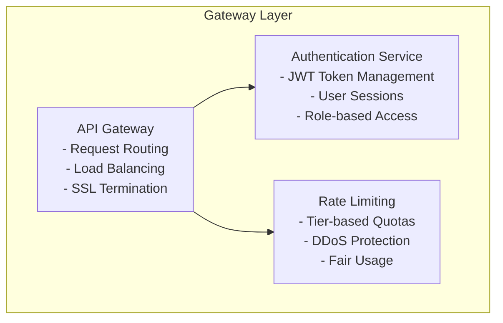
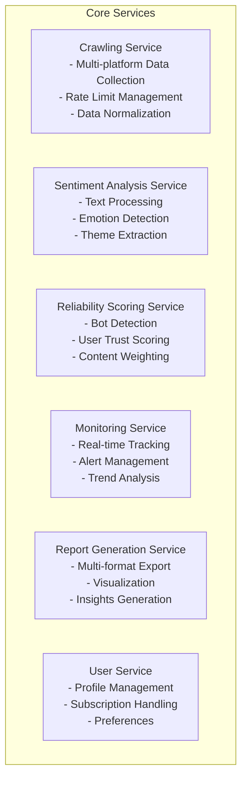
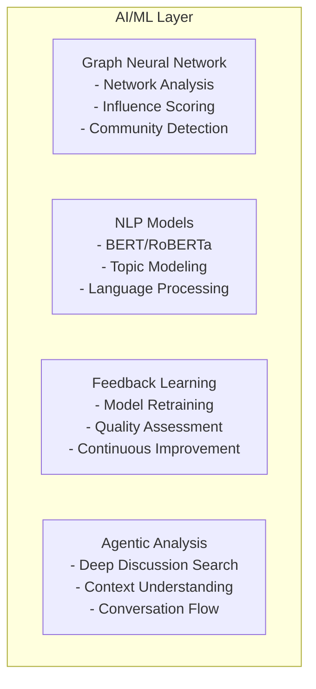
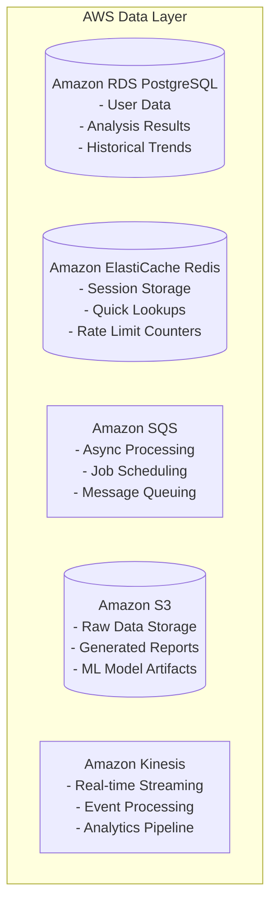
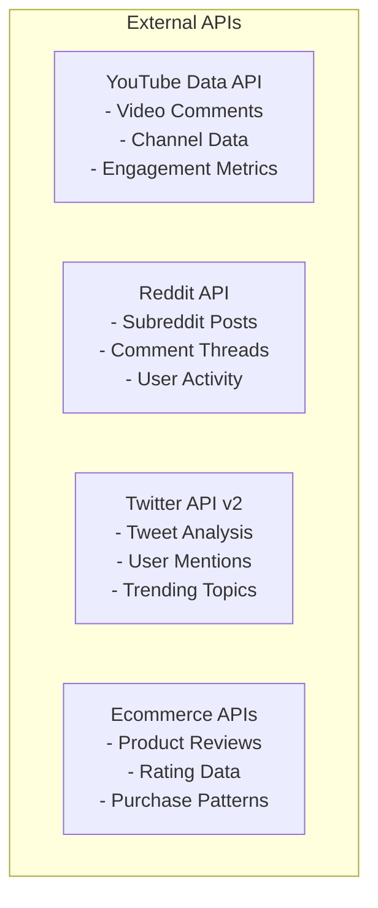
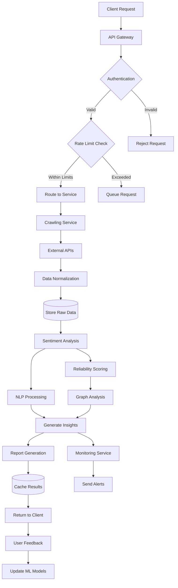
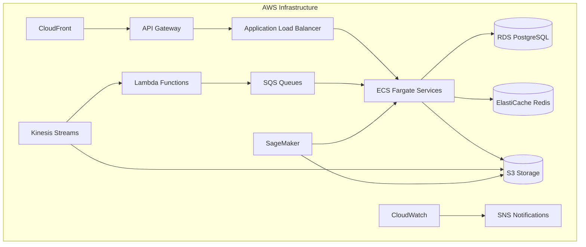
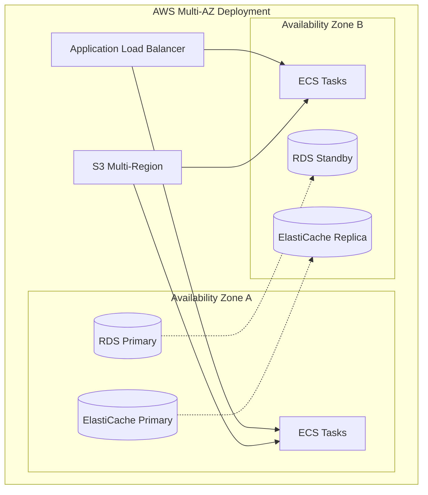

# Design Document: PRception Social Media Sentiment Analysis Platform

## Overview

PRception is an Agentic AI-powered social media sentiment analysis platform that provides comprehensive insights into public perception of products by crawling and analyzing discussions across multiple social media platforms. The system serves two primary user groups: vendors seeking business intelligence about their products, and end users making informed purchasing decisions.

The platform employs advanced machine learning techniques including Graph Neural Networks for reliability scoring, natural language processing for sentiment analysis, and agentic search algorithms for comprehensive data gathering. The architecture supports both real-time analysis and continuous monitoring capabilities through a scalable, cloud-native design.

Key technical differentiators include:
- Multi-platform crawling with intelligent rate limiting and retry mechanisms
- ML-powered user reliability scoring to filter out bots and unreliable sources
- Agentic discussion analysis that understands conversation context and flow
- Graph-based analysis of discussion networks to identify influential content
- Tiered service model supporting both free and premium users
- Browser extension for seamless integration with ecommerce browsing

## Architecture

The PRception platform follows a microservices architecture deployed on AWS cloud infrastructure, designed for horizontal scalability and high availability. The system leverages AWS services for compute, storage, messaging, and machine learning capabilities. The system is organized into several key layers:

### System Architecture Overview

The PRception platform is built using a layered microservices architecture that separates concerns and enables independent scaling of different components.

#### Layer 1: Client Interface Layer
This layer handles all user interactions and external integrations:



#### Layer 2: API Gateway and Security Layer
This layer manages authentication, rate limiting, and request routing:



#### Layer 3: Core Business Services Layer
This layer contains the main business logic and processing services:



#### Layer 4: AI/ML Processing Layer
This layer handles all machine learning and artificial intelligence operations:



#### Layer 5: Data and Infrastructure Layer
This layer manages data storage, caching, and message processing using AWS managed services:



#### Layer 6: External Integration Layer
This layer manages connections to external social media platforms and APIs:



### Complete System Data Flow

Here's how data flows through the entire system:



### AWS Infrastructure Architecture

The PRception platform is built on AWS cloud infrastructure, leveraging managed services for scalability, reliability, and cost optimization:

#### Compute Layer
- **Amazon ECS with Fargate**: Containerized microservices with serverless compute
- **AWS Lambda**: Event-driven functions for lightweight processing tasks
- **Amazon EC2**: GPU instances for ML model training and inference
- **AWS Batch**: Large-scale batch processing for data crawling jobs

#### Storage and Database Layer
- **Amazon RDS PostgreSQL**: Primary database with Multi-AZ deployment for high availability
- **Amazon ElastiCache Redis**: In-memory caching and session storage
- **Amazon S3**: Object storage for raw data, reports, and ML model artifacts
- **Amazon DynamoDB**: NoSQL database for high-velocity user activity tracking

#### Messaging and Streaming
- **Amazon SQS**: Message queuing for asynchronous task processing
- **Amazon SNS**: Push notifications and alert delivery
- **Amazon Kinesis**: Real-time data streaming and analytics
- **Amazon EventBridge**: Event-driven architecture coordination

#### Machine Learning and AI
- **Amazon SageMaker**: ML model training, deployment, and management
- **Amazon Comprehend**: Natural language processing and sentiment analysis
- **Amazon Textract**: Text extraction from various document formats
- **AWS Lambda with ML libraries**: Lightweight ML inference tasks

#### Security and Monitoring
- **AWS IAM**: Identity and access management with role-based permissions
- **AWS Secrets Manager**: Secure storage of API keys and credentials
- **Amazon CloudWatch**: Monitoring, logging, and alerting
- **AWS WAF**: Web application firewall for API protection
- **AWS Certificate Manager**: SSL/TLS certificate management

#### Content Delivery and API Management
- **Amazon CloudFront**: Global content delivery network for browser extension assets
- **Amazon API Gateway**: API management with rate limiting and authentication
- **AWS Application Load Balancer**: Traffic distribution across microservices

#### Data Analytics and Business Intelligence
- **Amazon QuickSight**: Business intelligence dashboards for vendors
- **AWS Glue**: ETL processes for data transformation
- **Amazon Athena**: Serverless query service for S3 data analysis
- **Amazon Redshift**: Data warehouse for historical analytics

### AWS Service Integration Patterns



### Cost Optimization Strategy

The platform implements several AWS cost optimization strategies:

1. **Auto Scaling**: ECS services and EC2 instances scale based on demand
2. **Spot Instances**: Use EC2 Spot instances for batch processing jobs
3. **S3 Intelligent Tiering**: Automatic data lifecycle management
4. **Reserved Instances**: Long-term commitments for predictable workloads
5. **Lambda for Lightweight Tasks**: Pay-per-execution for infrequent operations

### AWS Deployment Architecture



### Service Communication Patterns

The services communicate using AWS-native patterns:

1. **Synchronous Communication**: API Gateway + ALB for real-time requests
2. **Asynchronous Communication**: SQS/SNS for background processing
3. **Event-Driven Communication**: EventBridge + Kinesis for real-time updates
4. **Caching Strategy**: ElastiCache Redis for frequently accessed data
5. **Database Access**: RDS with connection pooling and read replicas

### Service Architecture Patterns

The platform implements several architectural patterns:

1. **Event-Driven Architecture**: Services communicate through message queues for asynchronous processing
2. **CQRS (Command Query Responsibility Segregation)**: Separate read and write models for optimal performance
3. **Circuit Breaker Pattern**: Fault tolerance for external API calls
4. **Bulkhead Pattern**: Resource isolation between different service tiers
5. **Saga Pattern**: Distributed transaction management for complex workflows

## Components and Interfaces

### Crawling Service

The Crawling Service is responsible for collecting data from multiple social media platforms while respecting rate limits and API constraints.

**Core Responsibilities:**
- Multi-platform data extraction (YouTube, Reddit, Twitter, ecommerce sites)
- Rate limiting and exponential backoff implementation
- Data normalization and standardization
- Crawling job scheduling and management
- Error handling and retry logic

**Key Interfaces:**
```typescript
interface CrawlingService {
  crawlProduct(productId: string, platforms: Platform[]): Promise<CrawlJob>
  getCrawlStatus(jobId: string): Promise<CrawlStatus>
  scheduleContinuousMonitoring(productId: string, interval: Duration): Promise<MonitoringJob>
  pauseCrawling(jobId: string): Promise<void>
  resumeCrawling(jobId: string): Promise<void>
}

interface CrawlJob {
  id: string
  productId: string
  platforms: Platform[]
  status: JobStatus
  progress: CrawlProgress
  createdAt: Date
  completedAt?: Date
  errors: CrawlError[]
}
```

**Platform Adapters:**
Each social media platform requires a specialized adapter that handles platform-specific APIs, authentication, and data formats:

- **YouTubeAdapter**: Handles YouTube Data API v3, comment threading, and video metadata
- **RedditAdapter**: Manages Reddit API, subreddit crawling, and comment tree traversal
- **TwitterAdapter**: Interfaces with Twitter API v2, handles tweet threading and user mentions
- **EcommerceAdapter**: Generic adapter for various ecommerce platforms with product review extraction

### Sentiment Analysis Service

The Sentiment Analysis Service processes collected text data to extract sentiment, themes, and insights.

**Core Responsibilities:**
- Text preprocessing and cleaning
- Sentiment classification (positive, negative, neutral)
- Theme and topic extraction
- Confidence scoring and uncertainty quantification
- Temporal sentiment analysis

**Key Interfaces:**
```typescript
interface SentimentAnalysisService {
  analyzeSentiment(content: TextContent[]): Promise<SentimentResult>
  extractThemes(content: TextContent[]): Promise<ThemeAnalysis>
  generateInsights(sentimentData: SentimentResult[]): Promise<InsightReport>
  trackSentimentTrends(productId: string, timeRange: TimeRange): Promise<TrendAnalysis>
}

interface SentimentResult {
  contentId: string
  sentiment: SentimentScore
  confidence: number
  themes: Theme[]
  emotions: EmotionScore[]
  reliability: number
}
```

### Reliability Scoring Service

The Reliability Scoring Service uses machine learning to assess the trustworthiness of users and content.

**Core Responsibilities:**
- User activity pattern analysis
- Bot detection and filtering
- Graph-based network analysis
- Reliability score computation and updates
- Content weighting based on source reliability

**Key Interfaces:**
```typescript
interface ReliabilityService {
  scoreUser(userId: string, platform: Platform): Promise<ReliabilityScore>
  detectBots(users: UserProfile[]): Promise<BotDetectionResult[]>
  updateReliabilityScores(activityData: UserActivity[]): Promise<void>
  getContentReliability(contentId: string): Promise<number>
}

interface ReliabilityScore {
  userId: string
  platform: Platform
  score: number
  confidence: number
  factors: ReliabilityFactor[]
  lastUpdated: Date
}
```

### Graph Neural Network Service

The GNN Service provides advanced network analysis capabilities for understanding discussion dynamics and user relationships.

**Core Responsibilities:**
- Discussion thread graph construction
- Influence propagation modeling
- Community detection in user networks
- Anomaly detection in discussion patterns
- Network-based reliability scoring

**Key Interfaces:**
```typescript
interface GraphNeuralNetworkService {
  buildDiscussionGraph(discussions: Discussion[]): Promise<DiscussionGraph>
  analyzeInfluence(graph: DiscussionGraph): Promise<InfluenceAnalysis>
  detectCommunities(userNetwork: UserNetwork): Promise<Community[]>
  scoreNetworkReliability(graph: DiscussionGraph): Promise<NetworkReliabilityScore>
}
```

### Monitoring Service

The Monitoring Service provides continuous tracking capabilities for premium users.

**Core Responsibilities:**
- Real-time sentiment change detection
- Alert threshold management
- Historical data tracking
- Trend analysis and forecasting
- Notification delivery

**Key Interfaces:**
```typescript
interface MonitoringService {
  createMonitor(productId: string, config: MonitorConfig): Promise<Monitor>
  updateAlertThresholds(monitorId: string, thresholds: AlertThreshold[]): Promise<void>
  getMonitoringData(monitorId: string, timeRange: TimeRange): Promise<MonitoringData>
  triggerAlert(alert: Alert): Promise<void>
}
```

### Report Generation Service

The Report Generation Service creates comprehensive reports and visualizations for users.

**Core Responsibilities:**
- Multi-format report generation (PDF, JSON, HTML)
- Data visualization and charting
- Executive summary creation
- Comparative analysis
- Custom report templates

**Key Interfaces:**
```typescript
interface ReportService {
  generateReport(productId: string, config: ReportConfig): Promise<Report>
  createComparison(productIds: string[]): Promise<ComparisonReport>
  exportReport(reportId: string, format: ExportFormat): Promise<ExportResult>
  scheduleReport(config: ScheduledReportConfig): Promise<ScheduledReport>
}
```

### Browser Extension Service

The Browser Extension Service provides seamless integration with ecommerce browsing.

**Core Responsibilities:**
- Product detection on ecommerce pages
- Real-time sentiment display
- Quick analysis requests
- User preference management
- Cross-platform compatibility

**Key Interfaces:**
```typescript
interface BrowserExtensionService {
  detectProduct(pageUrl: string, pageContent: string): Promise<ProductDetection>
  getQuickSentiment(productId: string): Promise<QuickSentimentResult>
  requestDetailedAnalysis(productId: string): Promise<AnalysisRequest>
  updateUserPreferences(preferences: ExtensionPreferences): Promise<void>
}
```

## Data Models

### Core Domain Models

**Product Model:**
```typescript
interface Product {
  id: string
  name: string
  brand: string
  category: string
  identifiers: ProductIdentifier[]
  metadata: ProductMetadata
  createdAt: Date
  updatedAt: Date
}

interface ProductIdentifier {
  platform: Platform
  externalId: string
  url: string
}
```

**Content Model:**
```typescript
interface Content {
  id: string
  productId: string
  platform: Platform
  type: ContentType
  text: string
  author: Author
  publishedAt: Date
  metrics: ContentMetrics
  parentId?: string
  threadId: string
}

interface Author {
  id: string
  username: string
  platform: Platform
  profileData: AuthorProfile
  reliabilityScore: number
}
```

**Sentiment Model:**
```typescript
interface SentimentAnalysis {
  id: string
  contentId: string
  sentiment: SentimentClassification
  confidence: number
  themes: Theme[]
  emotions: Emotion[]
  processedAt: Date
  modelVersion: string
}

interface SentimentClassification {
  label: 'positive' | 'negative' | 'neutral'
  score: number
  distribution: SentimentDistribution
}
```

**Discussion Model:**
```typescript
interface Discussion {
  id: string
  productId: string
  platform: Platform
  rootContentId: string
  participants: Participant[]
  sentimentEvolution: SentimentTimeline[]
  influentialPosts: string[]
  communityStructure: Community[]
}
```

### Analytics and Reporting Models

**Report Model:**
```typescript
interface AnalysisReport {
  id: string
  productId: string
  type: ReportType
  generatedAt: Date
  timeRange: TimeRange
  summary: ReportSummary
  sentimentBreakdown: SentimentBreakdown
  themes: ThemeAnalysis[]
  trends: TrendAnalysis[]
  recommendations: Recommendation[]
  reliability: ReliabilityMetrics
}

interface ReportSummary {
  overallSentiment: SentimentClassification
  totalMentions: number
  platformBreakdown: PlatformMetrics[]
  keyInsights: string[]
  confidenceLevel: number
}
```

**Monitoring Model:**
```typescript
interface Monitor {
  id: string
  productId: string
  userId: string
  config: MonitorConfig
  status: MonitorStatus
  alerts: Alert[]
  lastCheck: Date
  nextCheck: Date
}

interface MonitorConfig {
  platforms: Platform[]
  alertThresholds: AlertThreshold[]
  checkInterval: Duration
  notificationChannels: NotificationChannel[]
}
```

### User and Subscription Models

**User Model:**
```typescript
interface User {
  id: string
  email: string
  subscription: Subscription
  preferences: UserPreferences
  usage: UsageMetrics
  createdAt: Date
  lastActive: Date
}

interface Subscription {
  tier: 'free' | 'premium'
  status: SubscriptionStatus
  limits: UsageLimits
  billingCycle?: BillingCycle
  expiresAt?: Date
}
```

### Machine Learning Models

**Reliability Score Model:**
```typescript
interface ReliabilityScore {
  userId: string
  platform: Platform
  score: number
  confidence: number
  factors: ReliabilityFactor[]
  networkMetrics: NetworkMetrics
  activityPatterns: ActivityPattern[]
  lastUpdated: Date
}

interface ReliabilityFactor {
  type: FactorType
  weight: number
  value: number
  description: string
}
```

**Graph Network Model:**
```typescript
interface DiscussionGraph {
  id: string
  productId: string
  nodes: GraphNode[]
  edges: GraphEdge[]
  communities: Community[]
  influenceScores: InfluenceScore[]
  metrics: GraphMetrics
}

interface GraphNode {
  id: string
  type: 'user' | 'content' | 'discussion'
  properties: NodeProperties
  centrality: CentralityMetrics
}
```

## Correctness Properties

*A property is a characteristic or behavior that should hold true across all valid executions of a system—essentially, a formal statement about what the system should do. Properties serve as the bridge between human-readable specifications and machine-verifiable correctness guarantees.*

The following properties define the correctness requirements for the PRception platform, derived from the acceptance criteria in the requirements document. Each property is designed to be testable through property-based testing with generated inputs.

### Data Crawling Properties

**Property 1: Multi-platform crawling completeness**
*For any* product analysis request, crawling jobs should be created for all required platforms (YouTube, Reddit, Twitter, ecommerce) without exception.
**Validates: Requirements 1.1**

**Property 2: Rate limit handling consistency**
*For any* rate limit response from external APIs, the crawler should implement exponential backoff with increasing delays between retry attempts.
**Validates: Requirements 1.2**

**Property 3: Platform compliance universality**
*For any* platform being crawled, robots.txt rules and API limitations should be checked and respected before data collection begins.
**Validates: Requirements 1.3**

**Property 4: Data normalization consistency**
*For any* raw data collected from different platforms, the normalized output should conform to the standardized schema regardless of source platform.
**Validates: Requirements 1.4**

**Property 5: Audit logging completeness**
*For any* crawling operation performed, a corresponding log entry should be created with timestamp, status, and operation details.
**Validates: Requirements 1.5**

### Reliability Scoring Properties

**Property 6: Bot detection consistency**
*For any* user-generated content processed, users exhibiting known bot patterns should be consistently identified regardless of platform or content type.
**Validates: Requirements 2.1**

**Property 7: Network-based scoring determinism**
*For any* user network with identical connection patterns and interaction data, the Graph Neural Network should produce consistent reliability scores.
**Validates: Requirements 2.2**

**Property 8: Content flagging threshold consistency**
*For any* user whose reliability score falls below the configured threshold, all their content should be flagged as potentially unreliable.
**Validates: Requirements 2.3**

**Property 9: Score update responsiveness**
*For any* new user activity data added to the system, reliability scores should be recalculated and updated within the specified time window.
**Validates: Requirements 2.4**

**Property 10: Content weighting accuracy**
*For any* report generation, content should be weighted proportionally to the reliability scores of their authors.
**Validates: Requirements 2.5**

### Sentiment Analysis Properties

**Property 11: Sentiment classification completeness**
*For any* text content processed, the output should be classified into exactly one of the three sentiment categories (positive, negative, neutral).
**Validates: Requirements 3.1**

**Property 12: Trend analysis statistical validity**
*For any* time series sentiment data, generated trends should include valid statistical confidence intervals based on data variance and sample size.
**Validates: Requirements 3.2**

**Property 13: Theme extraction consistency**
*For any* discussion content analyzed, identified themes should be consistently linked to sentiment classifications and provide meaningful topic groupings.
**Validates: Requirements 3.3**

**Property 14: Multi-format export completeness**
*For any* analysis report generated, it should be exportable in all supported formats (PDF, JSON, interactive dashboard) with equivalent data content.
**Validates: Requirements 3.4**

**Property 15: Insight generation completeness**
*For any* completed sentiment analysis, actionable insights and recommendations should be generated based on the analysis results.
**Validates: Requirements 3.5**

### Browser Extension Properties

**Property 16: Product detection accuracy**
*For any* supported ecommerce product page, the browser extension should correctly detect and identify the product for analysis.
**Validates: Requirements 4.1**

**Property 17: Non-disruptive overlay behavior**
*For any* sentiment analysis request through the browser extension, results should be displayed in an overlay that doesn't interfere with existing page functionality.
**Validates: Requirements 4.2**

**Property 18: Cross-platform compatibility**
*For any* major ecommerce platform (Amazon, eBay, Shopify), the browser extension should function correctly and provide consistent features.
**Validates: Requirements 4.3**

**Property 19: Result display completeness**
*For any* sentiment analysis result displayed in the browser extension, all required elements (sentiment scores, insights, reliability indicators) should be present.
**Validates: Requirements 4.4**

**Property 20: Deep analysis request handling**
*For any* deeper analysis request made through the browser extension, it should be properly queued in the main platform system.
**Validates: Requirements 4.5**

### End User Support Properties

**Property 21: Visual sentiment indicator clarity**
*For any* sentiment analysis result presented to end users, visual indicators should accurately represent the overall sentiment classification.
**Validates: Requirements 5.1**

**Property 22: Theme highlighting accuracy**
*For any* product analysis, the most frequently occurring praise and criticism themes should be prominently highlighted in the results.
**Validates: Requirements 5.2**

**Property 23: Reliability score transparency**
*For any* analysis result presentation, the reliability score should be displayed based on data quality metrics and source diversity.
**Validates: Requirements 5.3**

**Property 24: Product comparison functionality**
*For any* set of similar products, users should be able to perform sentiment comparisons with side-by-side analysis results.
**Validates: Requirements 5.4**

**Property 25: Detailed analysis completeness**
*For any* detailed analysis request, the results should include sentiment trends over time and key discussion points.
**Validates: Requirements 5.5**

### Service Tier Properties

**Property 26: Free user request queuing**
*For any* analysis request from a free user, it should be placed in a processing queue and advertisements should be displayed during processing.
**Validates: Requirements 6.1**

**Property 27: Premium user instant processing**
*For any* analysis request from a premium user, it should be processed immediately without displaying advertisements.
**Validates: Requirements 6.2**

**Property 28: Premium monitoring capabilities**
*For any* premium user with monitoring enabled, continuous sentiment tracking and real-time alerts should be available.
**Validates: Requirements 6.3**

**Property 29: Request limit enforcement**
*For any* user tier, daily request limits should be enforced for free users while premium users should have unlimited access.
**Validates: Requirements 6.4**

**Property 30: Subscription change responsiveness**
*For any* subscription status change, user access privileges should be updated immediately without requiring system restart.
**Validates: Requirements 6.5**

### Monitoring Properties

**Property 31: Real-time sentiment tracking**
*For any* premium user with monitoring enabled, sentiment changes should be tracked and updated in real-time.
**Validates: Requirements 7.1**

**Property 32: Alert delivery reliability**
*For any* significant sentiment shift detected, alerts should be sent immediately through all configured notification channels.
**Validates: Requirements 7.2**

**Property 33: Historical data preservation**
*For any* monitoring activity, historical sentiment data should be maintained and remain accessible for trend analysis.
**Validates: Requirements 7.3**

**Property 34: Update frequency compliance**
*For any* active monitoring setup, sentiment scores should be updated at least every hour as specified.
**Validates: Requirements 7.4**

**Property 35: Configuration flexibility**
*For any* monitoring user, alert thresholds and notification preferences should be configurable and properly applied.
**Validates: Requirements 7.5**

### Agentic Discussion Analysis Properties

**Property 36: Depth-wise search completeness**
*For any* discussion analysis, depth-wise search should gather comprehensive conversation context including all related threads and replies.
**Validates: Requirements 8.1**

**Property 37: Influence identification accuracy**
*For any* discussion thread network, the Graph Neural Network should correctly identify the most influential posts and users based on network analysis.
**Validates: Requirements 8.2**

**Property 38: Sentiment evolution tracking**
*For any* discussion thread processed, conversation flow and sentiment changes over time should be accurately identified and tracked.
**Validates: Requirements 8.3**

**Property 39: Impact point detection**
*For any* discussion analyzed, key discussion points that significantly impact overall sentiment should be detected and highlighted.
**Validates: Requirements 8.4**

**Property 40: Discussion summary quality**
*For any* report generated, discussion summaries should include representative quotes and sufficient context for understanding.
**Validates: Requirements 8.5**

### Data Flywheel Properties

**Property 41: Feedback reward consistency**
*For any* user feedback provided on sentiment analysis accuracy, appropriate usage credits should be awarded based on feedback quality.
**Validates: Requirements 9.1**

**Property 42: Model improvement responsiveness**
*For any* user feedback collected, ML models should be retrained to incorporate the feedback and improve accuracy.
**Validates: Requirements 9.2**

**Property 43: Error flagging reliability**
*For any* reported incorrect sentiment classification, the corresponding data point should be flagged for review and correction.
**Validates: Requirements 9.3**

**Property 44: Quality-based reward adjustment**
*For any* user contribution, credit rewards should be adjusted based on the tracked quality of their feedback contributions.
**Validates: Requirements 9.4**

**Property 45: Automatic model updates**
*For any* sufficient accumulation of feedback data, model weights and thresholds should be automatically updated without manual intervention.
**Validates: Requirements 9.5**

### Security and Privacy Properties

**Property 46: Data encryption universality**
*For any* user data stored or transmitted, industry-standard encryption should be applied both in transit and at rest.
**Validates: Requirements 10.1**

**Property 47: Public data access restriction**
*For any* social media data collection operation, only publicly available information should be accessed and processed.
**Validates: Requirements 10.2**

**Property 48: Access control enforcement**
*For any* sensitive operation attempted, user authentication and authorization should be verified before allowing access.
**Validates: Requirements 10.3**

**Property 49: PII anonymization consistency**
*For any* user feedback and preferences stored, personally identifiable information should be properly anonymized.
**Validates: Requirements 10.4**

**Property 50: Privacy compliance capabilities**
*For any* user request for data export or deletion, the system should provide the requested capabilities in compliance with privacy regulations.
**Validates: Requirements 10.5**

### Performance Properties

**Property 51: Processing time compliance**
*For any* dataset processed for sentiment analysis, completion time should meet the acceptable limits defined for the user's service tier.
**Validates: Requirements 11.2**

## Error Handling

The PRception platform implements comprehensive error handling strategies across all components to ensure system reliability and user experience quality.

### Error Classification

**Transient Errors:**
- Network timeouts and connection failures
- Rate limiting from external APIs
- Temporary service unavailability
- Resource contention issues

**Permanent Errors:**
- Invalid API credentials
- Malformed data that cannot be processed
- Access denied to restricted content
- Unsupported platform or content types

**Business Logic Errors:**
- Insufficient user permissions
- Quota exceeded for service tier
- Invalid product identifiers
- Configuration errors

### Error Handling Strategies

**Circuit Breaker Pattern:**
The system implements circuit breakers for all external API calls to prevent cascading failures. When error rates exceed thresholds, the circuit opens and requests are either queued or served from cache.

**Exponential Backoff:**
For transient errors, the system implements exponential backoff with jitter to avoid thundering herd problems. Maximum retry attempts and backoff periods are configurable per service.

**Graceful Degradation:**
When components fail, the system provides degraded functionality rather than complete failure:
- If reliability scoring fails, content is processed with default weights
- If theme extraction fails, basic sentiment analysis is still provided
- If real-time monitoring fails, batch processing continues

**Error Recovery:**
The system maintains error recovery mechanisms:
- Failed crawling jobs are automatically retried with exponential backoff
- Partial analysis results are preserved and can be resumed
- User sessions are maintained across temporary service interruptions

**User Communication:**
Error messages are user-friendly and actionable:
- Clear explanation of what went wrong
- Expected resolution time when known
- Alternative actions users can take
- Contact information for persistent issues

## Testing Strategy

The PRception platform employs a comprehensive testing strategy that combines unit testing, property-based testing, integration testing, and end-to-end testing to ensure system correctness and reliability.

### Dual Testing Approach

**Unit Tests:**
Unit tests focus on specific examples, edge cases, and error conditions for individual components. They provide fast feedback during development and catch concrete bugs in business logic.

Key areas for unit testing:
- Data normalization edge cases (empty content, malformed data)
- Sentiment classification boundary conditions
- User authentication and authorization scenarios
- Configuration validation and error handling
- API response parsing and error cases

**Property-Based Tests:**
Property-based tests verify universal properties across all inputs using randomized test data. They provide comprehensive input coverage and catch edge cases that might be missed by example-based tests.

Each correctness property defined in this document must be implemented as a property-based test with:
- Minimum 100 iterations per test due to randomization
- Generated test data covering the full input space
- Clear property assertions that can be automatically verified
- Proper test tagging for traceability

### Property-Based Testing Configuration

**Testing Framework:** The system uses Hypothesis (Python) or fast-check (TypeScript) for property-based testing, depending on the service implementation language.

**Test Tagging:** Each property test must include a comment tag referencing its design document property:
```python
# Feature: prception, Property 1: Multi-platform crawling completeness
def test_crawling_completeness_property():
    # Test implementation
```

**Test Data Generation:**
- User profiles with varying activity patterns and reliability indicators
- Product data across different categories and platforms
- Discussion threads with complex reply structures and sentiment patterns
- Social media content with diverse formats and languages
- Network graphs with different community structures and influence patterns

**Property Test Examples:**

```python
@given(product_requests=st.lists(st.text(), min_size=1))
def test_multi_platform_crawling_completeness(product_requests):
    """Property 1: For any product analysis request, crawling jobs 
    should be created for all required platforms."""
    for request in product_requests:
        jobs = crawler.create_crawling_jobs(request)
        required_platforms = {'youtube', 'reddit', 'twitter', 'ecommerce'}
        created_platforms = {job.platform for job in jobs}
        assert required_platforms.issubset(created_platforms)

@given(user_networks=generate_user_networks())
def test_network_scoring_determinism(user_networks):
    """Property 7: For any user network with identical patterns,
    GNN should produce consistent reliability scores."""
    for network in user_networks:
        score1 = gnn.score_network_reliability(network)
        score2 = gnn.score_network_reliability(network)
        assert abs(score1 - score2) < 0.001  # Deterministic within tolerance
```

### Integration Testing

Integration tests verify that components work correctly together:
- Crawling service integration with external APIs
- Sentiment analysis pipeline from raw data to insights
- Browser extension communication with backend services
- Monitoring service alert delivery mechanisms
- User authentication flow across all services

### End-to-End Testing

End-to-end tests validate complete user workflows:
- Product analysis request from browser extension to final report
- Premium user monitoring setup and alert delivery
- Free user experience with queuing and advertisements
- Data flywheel feedback loop from user input to model improvement

### Performance Testing

Performance tests ensure the system meets scalability requirements:
- Load testing with simulated concurrent users
- Stress testing of crawling services under rate limits
- Memory and CPU profiling of ML model inference
- Database performance under high query loads

### Security Testing

Security tests validate protection mechanisms:
- Authentication and authorization bypass attempts
- Data encryption verification in transit and at rest
- Input validation and injection attack prevention
- Privacy compliance verification for data handling

### Test Environment Strategy

**Development:** Fast feedback with mocked external services
**Staging:** Full integration testing with rate-limited external APIs
**Production:** Continuous monitoring and canary deployments

The testing strategy ensures that all correctness properties are verified, system reliability is maintained, and user experience quality is preserved across all deployment environments.